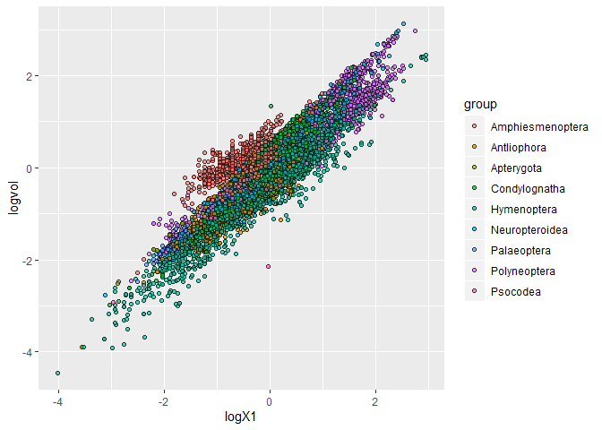

#packages

```r
library(tidyverse)
```

```
## -- Attaching packages ------------------------------------------------------ tidyverse 1.2.1 --
```

```
## v ggplot2 3.2.1     v purrr   0.3.2
## v tibble  2.1.3     v dplyr   0.8.3
## v tidyr   1.0.0     v stringr 1.4.0
## v readr   1.3.1     v forcats 0.4.0
```

```
## -- Conflicts --------------------------------------------------------- tidyverse_conflicts() --
## x dplyr::filter() masks stats::filter()
## x dplyr::lag()    masks stats::lag()
```

```r
library(caret)
```

```
## Loading required package: lattice
```

```
## 
## Attaching package: 'caret'
```

```
## The following object is masked from 'package:purrr':
## 
##     lift
```

```r
library(ggplot2)
library(e1071)
```

# data

```r
insectSize = readr::read_tsv("https://raw.githubusercontent.com/shchurch/insect_egg_database_viz/master/data/dataviz_egg_database.csv")
```

```
## Parsed with column specification:
## cols(
##   .default = col_double(),
##   bibtex = col_character(),
##   bib_author = col_character(),
##   family = col_character(),
##   superfamily = col_character(),
##   subfamily = col_character(),
##   suborder = col_character(),
##   order = col_character(),
##   tribe = col_character(),
##   genus = col_character(),
##   species = col_character(),
##   name = col_character(),
##   new_name = col_character(),
##   image = col_character(),
##   group = col_character()
## )
```

```
## See spec(...) for full column specifications.
```

```r
head (insectSize)
```

```
## # A tibble: 6 x 48
##      ID bibtex bib_author  year family superfamily subfamily suborder order
##   <dbl> <chr>  <chr>      <dbl> <chr>  <chr>       <chr>     <chr>    <chr>
## 1    17 Herna~ Hernández~  2013 Pieri~ Papilionoi~ Pierinae  Glossata Lepi~
## 2    18 Herna~ Hernández~  2013 Pieri~ Papilionoi~ Pierinae  Glossata Lepi~
## 3    19 Herna~ Hernández~  2013 Pieri~ Papilionoi~ Pierinae  Glossata Lepi~
## 4    20 Herna~ Hernández~  2013 Pieri~ Papilionoi~ Pierinae  Glossata Lepi~
## 5    21 Peter~ Peterson,~  1968 Geome~ Geometroid~ Geometri~ Glossata Lepi~
## 6    22 Peter~ Peterson,~  1968 Geome~ Geometroid~ <NA>      Glossata Lepi~
## # ... with 39 more variables: tribe <chr>, genus <chr>, species <chr>,
## #   name <chr>, new_name <chr>, image <chr>, txtX1 <dbl>, txtX2 <dbl>,
## #   txtvol <dbl>, txtar <dbl>, txtel <dbl>, logtxtar <dbl>,
## #   logtxtX1 <dbl>, logtxtX2 <dbl>, logtxtvol <dbl>, imX1 <dbl>,
## #   imX2 <dbl>, logimX1 <dbl>, logimX2 <dbl>, imvol <dbl>, imar <dbl>,
## #   imel <dbl>, logimar <dbl>, asym <dbl>, curv <dbl>, sqasym <dbl>,
## #   sqcurv <dbl>, X1 <dbl>, X2 <dbl>, X3 <dbl>, logX1 <dbl>, logX2 <dbl>,
## #   logX3 <dbl>, ar <dbl>, el <dbl>, vol <dbl>, logar <dbl>, logvol <dbl>,
## #   group <chr>
```

# Columns selection

```r
insectSizeGroup =insectSize %>% 
  select(logX1,logX2, logvol, group)
```

# missing values


```r
length(which(!complete.cases(insectSizeGroup)))
```

```
## [1] 2453
```
# Proportion

```r
table(insectSizeGroup$group)
```

```
## 
## Amphiesmenoptera      Antliophora       Apterygota    Condylognatha 
##             2978             1026               20             1259 
##      Hymenoptera   Neuropteroidea      Palaeoptera     Polyneoptera 
##             1768              870              314             1550 
##         Psocodea 
##               64
```

# No NA


```r
insectSizeClean <- na.omit(insectSizeGroup)
length(which(!complete.cases(insectSizeClean)))
```

```
## [1] 0
```

```r
#head(insectSizeClean)
```


# Normalization

```r
scale2 <- function(x) (x - mean(x, na.rm = TRUE)) / sd(x, TRUE)
insectSizeMeans <- insectSizeClean %>% 
                          mutate_if(is.double, scale2)
#head(insectSizeMeans)
```

# Trainnin Set

```r
insectSizeTrain <- insectSizeMeans %>%
                  select("logX1",'logX2', "logvol")


#head(insectSizeTrain)

insectSizeLabels <- insectSizeMeans$group
```

# Model

```r
k <- data.frame(k = 5)
model_knn <- train(x = data.frame(insectSizeTrain),
                   y = insectSizeLabels,
                   method='knn',
                   tuneGrid = k)
#head(model_knn)
```
# Prediction

```r
newObs <- data.frame(logX1= 0.577,logX2=0.267, logvol= 0.398)

predict(object = model_knn, newdata = newObs)
```

```
## [1] Antliophora
## 9 Levels: Amphiesmenoptera Antliophora Apterygota ... Psocodea
```

# Visualization


```r
new_logX1 <- seq(from = min(insectSizeTrain$logX1), to = max(insectSizeTrain$logX1), length.out = 10)
new_logX2 <- seq(from = min(insectSizeTrain$logX2), to = max(insectSizeTrain$logX2), length.out = 10)
new_logvol <- seq(from = min(insectSizeTrain$logvol), to = median(insectSizeTrain$logvol), length.out = 10)

grid_data <- expand_grid(logX1 = new_logX1,
                         logX2 = new_logX2,
                         logvol = new_logvol)

grid_data$group <- predict(object = model_knn, newdata = as.data.frame(grid_data))

insectSizeMeans %>% 
  ggplot(aes(x = logX1, y = logvol, color = group, fill = group)) + 
  #geom_point(data = grid_data, alpha = 0.5)+ 
  geom_point(alpha = 0.7, pch = 21, color = "black")+ 
  scale_color_brewer(type = "qual")
```

<!-- -->

```r
  #scale_fill_brewer(type = "qual")
```

# Data partition

```r
set.seed(500) # makes the random selection of rows reproducible
train <- insectSizeMeans$group %>%
          createDataPartition(p = 0.70, list = FALSE)
#head(train)

insectSizeTrain2 <- insectSizeMeans[train,]%>%
                        select("logX1",'logX2', "logvol")
insectSizeTrainTest2 <- insectSizeMeans[-train,]%>%
                          select("logX1",'logX2', "logvol")

insectSizeLabels2 <- insectSizeMeans[train,]$group
                        #select('group')

#head(insectSizeLabels2)
typeof(insectSizeLabels2)
```

```
## [1] "character"
```
# Model from partition

```r
k <- data.frame(k =5)
model_knn2 <- train(x = data.frame(insectSizeTrain2),
                   y = insectSizeLabels2,
                   method='knn',
                   tuneGrid = k)
#head(model_knn2)
```
#Test samples

```r
prediction = predict(object = model_knn2, newdata = insectSizeTrainTest2)
#prediction
```

#insectSizeMeans into numeric

```r
# Convert character vector to factor
comp = insectSizeMeans[-train,]$group 
        #%>%
       #select('group')
tableCompare<- factor(comp, levels = as.character(unique(comp)))

typeof(comp)
```

```
## [1] "character"
```

```r
#head(tableCompare)
```


# ConfusionMatrix


```r
confusionMatrix(prediction,tableCompare)
```

```
## Warning in confusionMatrix.default(prediction, tableCompare): Levels are
## not in the same order for reference and data. Refactoring data to match.
```

```
## Confusion Matrix and Statistics
## 
##                   Reference
## Prediction         Amphiesmenoptera Polyneoptera Antliophora
##   Amphiesmenoptera              348           21          13
##   Polyneoptera                   18          288           3
##   Antliophora                     4            3         107
##   Neuropteroidea                 36           16          14
##   Psocodea                        0            0           2
##   Condylognatha                  43           12          36
##   Palaeoptera                     5            5           9
##   Hymenoptera                     6           21          65
##   Apterygota                      0            0           0
##                   Reference
## Prediction         Neuropteroidea Psocodea Condylognatha Palaeoptera
##   Amphiesmenoptera             27        0            59          10
##   Polyneoptera                 38        0            14          11
##   Antliophora                  20        1            46           7
##   Neuropteroidea               54        3            52           1
##   Psocodea                      0        1             2           0
##   Condylognatha                56        3           114           4
##   Palaeoptera                   5        0             3          38
##   Hymenoptera                  27        4            54          17
##   Apterygota                    0        0             0           0
##                   Reference
## Prediction         Hymenoptera Apterygota
##   Amphiesmenoptera          12          1
##   Polyneoptera              32          1
##   Antliophora               54          0
##   Neuropteroidea            22          0
##   Psocodea                   0          0
##   Condylognatha             43          1
##   Palaeoptera                9          1
##   Hymenoptera              292          1
##   Apterygota                 0          0
## 
## Overall Statistics
##                                           
##                Accuracy : 0.5607          
##                  95% CI : (0.5398, 0.5815)
##     No Information Rate : 0.2095          
##     P-Value [Acc > NIR] : < 2.2e-16       
##                                           
##                   Kappa : 0.4727          
##                                           
##  Mcnemar's Test P-Value : NA              
## 
## Statistics by Class:
## 
##                      Class: Amphiesmenoptera Class: Polyneoptera
## Sensitivity                           0.7565              0.7869
## Specificity                           0.9185              0.9367
## Pos Pred Value                        0.7088              0.7111
## Neg Pred Value                        0.9350              0.9569
## Prevalence                            0.2077              0.1652
## Detection Rate                        0.1571              0.1300
## Detection Prevalence                  0.2217              0.1828
## Balanced Accuracy                     0.8375              0.8618
##                      Class: Antliophora Class: Neuropteroidea
## Sensitivity                     0.42972               0.23789
## Specificity                     0.93133               0.92757
## Pos Pred Value                  0.44215               0.27273
## Neg Pred Value                  0.92803               0.91423
## Prevalence                      0.11242               0.10248
## Detection Rate                  0.04831               0.02438
## Detection Prevalence            0.10926               0.08939
## Balanced Accuracy               0.68053               0.58273
##                      Class: Psocodea Class: Condylognatha
## Sensitivity                0.0833333              0.33140
## Specificity                0.9981843              0.89417
## Pos Pred Value             0.2000000              0.36538
## Neg Pred Value             0.9950226              0.87914
## Prevalence                 0.0054176              0.15530
## Detection Rate             0.0004515              0.05147
## Detection Prevalence       0.0022573              0.14086
## Balanced Accuracy          0.5407588              0.61278
##                      Class: Palaeoptera Class: Hymenoptera
## Sensitivity                     0.43182             0.6293
## Specificity                     0.98260             0.8886
## Pos Pred Value                  0.50667             0.5996
## Neg Pred Value                  0.97664             0.9005
## Prevalence                      0.03973             0.2095
## Detection Rate                  0.01716             0.1318
## Detection Prevalence            0.03386             0.2199
## Balanced Accuracy               0.70721             0.7590
##                      Class: Apterygota
## Sensitivity                   0.000000
## Specificity                   1.000000
## Pos Pred Value                     NaN
## Neg Pred Value                0.997743
## Prevalence                    0.002257
## Detection Rate                0.000000
## Detection Prevalence          0.000000
## Balanced Accuracy             0.500000
```

# Cross validation

```r
trainCross = trainControl(method = 'repeatedcv',
                          number = 10,
                          repeats = 1,
                          search='grid')

#tuneGrid
k <- data.frame(k =3:10)
model_knnVal <- train(x = data.frame(insectSizeTrain2),
                   y = insectSizeLabels2,
                   method='knn',
                   tuneGrid = k,
                   trControl = trainCross)
#head(model_knnVal)
```
# Use K=8 for training


```r
k <- data.frame(k =8)
model_knn3 <- train(x = data.frame(insectSizeTrain2),
                   y = insectSizeLabels2,
                   method='knn',
                   tuneGrid = k)
#head(model_knn3)
```
# Test with K=8

```r
prediction2 = predict(object = model_knn3, newdata = insectSizeTrainTest2)
#prediction2
```
# Confusion matrix from model K=8

```r
confusionMatrix(prediction2,tableCompare)
```

```
## Warning in confusionMatrix.default(prediction2, tableCompare): Levels are
## not in the same order for reference and data. Refactoring data to match.
```

```
## Confusion Matrix and Statistics
## 
##                   Reference
## Prediction         Amphiesmenoptera Polyneoptera Antliophora
##   Amphiesmenoptera              361           15          12
##   Polyneoptera                   18          295           3
##   Antliophora                     1            3         111
##   Neuropteroidea                 27           13          10
##   Psocodea                        0            0           1
##   Condylognatha                  43            8          35
##   Palaeoptera                     1            8          11
##   Hymenoptera                     9           23          66
##   Apterygota                      0            1           0
##                   Reference
## Prediction         Neuropteroidea Psocodea Condylognatha Palaeoptera
##   Amphiesmenoptera             28        0            55          12
##   Polyneoptera                 36        0            12          11
##   Antliophora                  13        0            35           6
##   Neuropteroidea               64        3            59           2
##   Psocodea                      0        0             0           0
##   Condylognatha                52        5           120           1
##   Palaeoptera                   3        0             3          41
##   Hymenoptera                  31        4            60          15
##   Apterygota                    0        0             0           0
##                   Reference
## Prediction         Hymenoptera Apterygota
##   Amphiesmenoptera           4          1
##   Polyneoptera              36          1
##   Antliophora               61          0
##   Neuropteroidea            13          0
##   Psocodea                   0          0
##   Condylognatha             46          2
##   Palaeoptera               12          1
##   Hymenoptera              292          0
##   Apterygota                 0          0
## 
## Overall Statistics
##                                           
##                Accuracy : 0.5797          
##                  95% CI : (0.5588, 0.6003)
##     No Information Rate : 0.2095          
##     P-Value [Acc > NIR] : < 2.2e-16       
##                                           
##                   Kappa : 0.4951          
##                                           
##  Mcnemar's Test P-Value : NA              
## 
## Statistics by Class:
## 
##                      Class: Amphiesmenoptera Class: Polyneoptera
## Sensitivity                           0.7848              0.8060
## Specificity                           0.9276              0.9367
## Pos Pred Value                        0.7398              0.7160
## Neg Pred Value                        0.9427              0.9606
## Prevalence                            0.2077              0.1652
## Detection Rate                        0.1630              0.1332
## Detection Prevalence                  0.2203              0.1860
## Balanced Accuracy                     0.8562              0.8714
##                      Class: Antliophora Class: Neuropteroidea
## Sensitivity                     0.44578               0.28194
## Specificity                     0.93947               0.93612
## Pos Pred Value                  0.48261               0.33508
## Neg Pred Value                  0.93048               0.91947
## Prevalence                      0.11242               0.10248
## Detection Rate                  0.05011               0.02889
## Detection Prevalence            0.10384               0.08623
## Balanced Accuracy               0.69263               0.60903
##                      Class: Psocodea Class: Condylognatha
## Sensitivity                0.0000000              0.34884
## Specificity                0.9995461              0.89738
## Pos Pred Value             0.0000000              0.38462
## Neg Pred Value             0.9945799              0.88229
## Prevalence                 0.0054176              0.15530
## Detection Rate             0.0000000              0.05418
## Detection Prevalence       0.0004515              0.14086
## Balanced Accuracy          0.4997730              0.62311
##                      Class: Palaeoptera Class: Hymenoptera
## Sensitivity                     0.46591             0.6293
## Specificity                     0.98166             0.8812
## Pos Pred Value                  0.51250             0.5840
## Neg Pred Value                  0.97799             0.8997
## Prevalence                      0.03973             0.2095
## Detection Rate                  0.01851             0.1318
## Detection Prevalence            0.03612             0.2257
## Balanced Accuracy               0.72379             0.7553
##                      Class: Apterygota
## Sensitivity                  0.0000000
## Specificity                  0.9995475
## Pos Pred Value               0.0000000
## Neg Pred Value               0.9977416
## Prevalence                   0.0022573
## Detection Rate               0.0000000
## Detection Prevalence         0.0004515
## Balanced Accuracy            0.4997738
```

