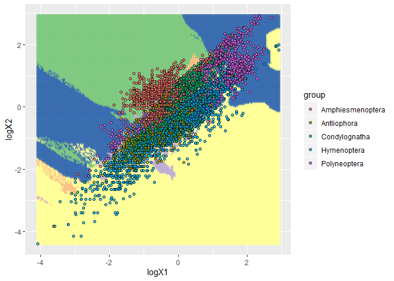
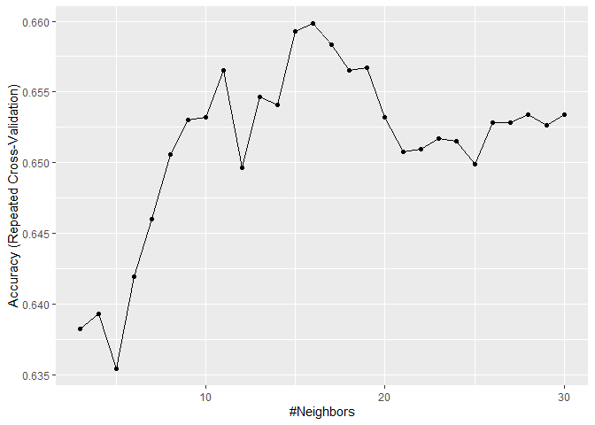
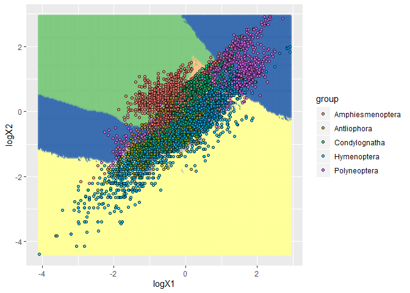

#packages

```r
library(tidyverse)
library(caret)
library(ggplot2)
library(e1071)
```

# data

```r
insectSize = readr::read_tsv("https://raw.githubusercontent.com/shchurch/insect_egg_database_viz/master/data/dataviz_egg_database.csv")
```

```
## Parsed with column specification:
## cols(
##   .default = col_double(),
##   bibtex = col_character(),
##   bib_author = col_character(),
##   family = col_character(),
##   superfamily = col_character(),
##   subfamily = col_character(),
##   suborder = col_character(),
##   order = col_character(),
##   tribe = col_character(),
##   genus = col_character(),
##   species = col_character(),
##   name = col_character(),
##   new_name = col_character(),
##   image = col_character(),
##   group = col_character()
## )
```

```
## See spec(...) for full column specifications.
```

```r
head (insectSize)
```

```
## # A tibble: 6 x 48
##      ID bibtex bib_author  year family superfamily subfamily suborder order
##   <dbl> <chr>  <chr>      <dbl> <chr>  <chr>       <chr>     <chr>    <chr>
## 1    17 Herna~ Hernández~  2013 Pieri~ Papilionoi~ Pierinae  Glossata Lepi~
## 2    18 Herna~ Hernández~  2013 Pieri~ Papilionoi~ Pierinae  Glossata Lepi~
## 3    19 Herna~ Hernández~  2013 Pieri~ Papilionoi~ Pierinae  Glossata Lepi~
## 4    20 Herna~ Hernández~  2013 Pieri~ Papilionoi~ Pierinae  Glossata Lepi~
## 5    21 Peter~ Peterson,~  1968 Geome~ Geometroid~ Geometri~ Glossata Lepi~
## 6    22 Peter~ Peterson,~  1968 Geome~ Geometroid~ <NA>      Glossata Lepi~
## # ... with 39 more variables: tribe <chr>, genus <chr>, species <chr>,
## #   name <chr>, new_name <chr>, image <chr>, txtX1 <dbl>, txtX2 <dbl>,
## #   txtvol <dbl>, txtar <dbl>, txtel <dbl>, logtxtar <dbl>,
## #   logtxtX1 <dbl>, logtxtX2 <dbl>, logtxtvol <dbl>, imX1 <dbl>,
## #   imX2 <dbl>, logimX1 <dbl>, logimX2 <dbl>, imvol <dbl>, imar <dbl>,
## #   imel <dbl>, logimar <dbl>, asym <dbl>, curv <dbl>, sqasym <dbl>,
## #   sqcurv <dbl>, X1 <dbl>, X2 <dbl>, X3 <dbl>, logX1 <dbl>, logX2 <dbl>,
## #   logX3 <dbl>, ar <dbl>, el <dbl>, vol <dbl>, logar <dbl>, logvol <dbl>,
## #   group <chr>
```

# Columns selection (without logvol)

```r
insectSizeGroup =insectSize %>% 
  select(logX1, logX2, group)
```

# missing values


```r
length(which(!complete.cases(insectSizeGroup)))
```

```
## [1] 2453
```
# Proportion

```r
table(insectSizeGroup$group)
```

```
## 
## Amphiesmenoptera      Antliophora       Apterygota    Condylognatha 
##             2978             1026               20             1259 
##      Hymenoptera   Neuropteroidea      Palaeoptera     Polyneoptera 
##             1768              870              314             1550 
##         Psocodea 
##               64
```
# Smaller selection of groups

```r
# On va garder les ordres qui sont plus nombreux (qui va simplifier le knn aussi)
insectSizeGroup_less<-insectSizeGroup[which(insectSizeGroup$group != 'Apterygota'),]
insectSizeGroup_less<-insectSizeGroup_less[which(insectSizeGroup_less$group != 'Psocodea'),]
insectSizeGroup_less<-insectSizeGroup_less[which(insectSizeGroup_less$group != 'Palaeoptera'),]
insectSizeGroup_less<-insectSizeGroup_less[which(insectSizeGroup_less$group != 'Neuropteroidea'),]
table(insectSizeGroup_less$group)
```

```
## 
## Amphiesmenoptera      Antliophora    Condylognatha      Hymenoptera 
##             2978             1026             1259             1768 
##     Polyneoptera 
##             1550
```

# No NA


```r
insectSizeClean <- na.omit(insectSizeGroup_less)
length(which(!complete.cases(insectSizeClean)))
```

```
## [1] 0
```

```r
#head(insectSizeClean)
```


# Normalization

```r
scale2 <- function(x) (x - mean(x, na.rm = TRUE)) / sd(x, TRUE)
insectSizeMeans <- insectSizeClean %>% 
                          mutate_if(is.double, scale2)
#head(insectSizeMeans)
```

# Evening out the data

```r
insectSizeMeans_up <- upSample(x=insectSizeMeans, y=as_factor(insectSizeMeans$group), list=FALSE)
table(insectSizeMeans_up$group)
```

```
## 
## Amphiesmenoptera      Antliophora    Condylognatha      Hymenoptera 
##             1547             1547             1547             1547 
##     Polyneoptera 
##             1547
```

# Training Set

```r
insectSizeTrain <- insectSizeMeans_up %>%
                  select("logX1", "logX2")


#head(insectSizeTrain)

insectSizeLabels <- insectSizeMeans_up$group
```

# Model

```r
k <- data.frame(k = 5)
model_knn <- train(x = data.frame(insectSizeTrain),
                   y = insectSizeLabels,
                   method='knn',
                   tuneGrid = k)
#head(model_knn)
```
# Prediction

```r
newObs <- data.frame(logX1= 0.577, logX2= 0.398)

predict(object = model_knn, newdata = newObs)
```

```
## [1] Hymenoptera
## 5 Levels: Amphiesmenoptera Antliophora Condylognatha ... Polyneoptera
```

# Visualization


```r
new_logX1 <- seq(from = min(insectSizeTrain$logX1), to = max(insectSizeTrain$logX1), length.out = 200)
new_logX2 <- seq(from = min(insectSizeTrain$logX2), to = max(insectSizeTrain$logX2), length.out = 200)

grid_data <- expand_grid(logX1 = new_logX1,logX2 = new_logX2)

grid_data$group <- predict(object = model_knn, newdata = as.data.frame(grid_data))

insectSizeMeans %>% 
  ggplot(aes(x = logX1, y = logX2, color = group, fill = group)) + 
  geom_point(data = grid_data, alpha = 0.5)+ 
  geom_point(alpha = 0.7, pch = 21, color = "black")+ 
  scale_color_brewer(type = "qual")
```

<!-- -->

```r
  scale_fill_brewer(type = "qual")
```

```
## <ggproto object: Class ScaleDiscrete, Scale, gg>
##     aesthetics: fill
##     axis_order: function
##     break_info: function
##     break_positions: function
##     breaks: waiver
##     call: call
##     clone: function
##     dimension: function
##     drop: TRUE
##     expand: waiver
##     get_breaks: function
##     get_breaks_minor: function
##     get_labels: function
##     get_limits: function
##     guide: legend
##     is_discrete: function
##     is_empty: function
##     labels: waiver
##     limits: NULL
##     make_sec_title: function
##     make_title: function
##     map: function
##     map_df: function
##     n.breaks.cache: NULL
##     na.translate: TRUE
##     na.value: NA
##     name: waiver
##     palette: function
##     palette.cache: NULL
##     position: left
##     range: <ggproto object: Class RangeDiscrete, Range, gg>
##         range: NULL
##         reset: function
##         train: function
##         super:  <ggproto object: Class RangeDiscrete, Range, gg>
##     reset: function
##     scale_name: brewer
##     train: function
##     train_df: function
##     transform: function
##     transform_df: function
##     super:  <ggproto object: Class ScaleDiscrete, Scale, gg>
```

# Data partition

```r
set.seed(500) # makes the random selection of rows reproducible
train <- insectSizeMeans_up$group %>%
          createDataPartition(p = 0.70, list = FALSE)
#head(train)

insectSizeTrain2 <- insectSizeMeans_up[train,]%>%
                        select("logX1", "logX2")
insectSizeTrainTest2 <- insectSizeMeans_up[-train,]%>%
                          select("logX1", "logX2")

insectSizeLabels2 <- insectSizeMeans_up[train,]$group
                        #select('group')

#head(insectSizeLabels2)
typeof(insectSizeLabels2)
```

```
## [1] "character"
```
# Model from partition

```r
k <- data.frame(k =5)
model_knn2 <- train(x = data.frame(insectSizeTrain2),
                   y = insectSizeLabels2,
                   method='knn',
                   tuneGrid = k)
#head(model_knn2)
```
#Test samples

```r
prediction = predict(object = model_knn2, newdata = insectSizeTrainTest2)
head(prediction)
```

```
## [1] Hymenoptera      Hymenoptera      Amphiesmenoptera Amphiesmenoptera
## [5] Antliophora      Polyneoptera    
## 5 Levels: Amphiesmenoptera Antliophora Condylognatha ... Polyneoptera
```

#insectSizeMeans into numeric

```r
# Convert character vector to factor
comp = insectSizeMeans_up[-train,]$group 
        #%>%
       #select('group')
tableCompare<- factor(comp) # Laisser la fonction décider des levels pour les mettre en ordre

typeof(comp)
```

```
## [1] "character"
```

```r
head(tableCompare)
```

```
## [1] Amphiesmenoptera Amphiesmenoptera Amphiesmenoptera Amphiesmenoptera
## [5] Amphiesmenoptera Amphiesmenoptera
## 5 Levels: Amphiesmenoptera Antliophora Condylognatha ... Polyneoptera
```


# ConfusionMatrix


```r
confusionMatrix(prediction,tableCompare)
```

```
## Confusion Matrix and Statistics
## 
##                   Reference
## Prediction         Amphiesmenoptera Antliophora Condylognatha Hymenoptera
##   Amphiesmenoptera              339          22            64           8
##   Antliophora                    15         306            82         118
##   Condylognatha                  80          62           247          57
##   Hymenoptera                     5          68            53         238
##   Polyneoptera                   25           6            18          43
##                   Reference
## Prediction         Polyneoptera
##   Amphiesmenoptera           27
##   Antliophora                10
##   Condylognatha              32
##   Hymenoptera                24
##   Polyneoptera              371
## 
## Overall Statistics
##                                           
##                Accuracy : 0.647           
##                  95% CI : (0.6271, 0.6664)
##     No Information Rate : 0.2             
##     P-Value [Acc > NIR] : < 2.2e-16       
##                                           
##                   Kappa : 0.5587          
##                                           
##  Mcnemar's Test P-Value : 0.0006977       
## 
## Statistics by Class:
## 
##                      Class: Amphiesmenoptera Class: Antliophora
## Sensitivity                           0.7306             0.6595
## Specificity                           0.9348             0.8788
## Pos Pred Value                        0.7370             0.5763
## Neg Pred Value                        0.9328             0.9117
## Prevalence                            0.2000             0.2000
## Detection Rate                        0.1461             0.1319
## Detection Prevalence                  0.1983             0.2289
## Balanced Accuracy                     0.8327             0.7691
##                      Class: Condylognatha Class: Hymenoptera
## Sensitivity                        0.5323             0.5129
## Specificity                        0.8755             0.9192
## Pos Pred Value                     0.5167             0.6134
## Neg Pred Value                     0.8822             0.8830
## Prevalence                         0.2000             0.2000
## Detection Rate                     0.1065             0.1026
## Detection Prevalence               0.2060             0.1672
## Balanced Accuracy                  0.7039             0.7161
##                      Class: Polyneoptera
## Sensitivity                       0.7996
## Specificity                       0.9504
## Pos Pred Value                    0.8013
## Neg Pred Value                    0.9499
## Prevalence                        0.2000
## Detection Rate                    0.1599
## Detection Prevalence              0.1996
## Balanced Accuracy                 0.8750
```

# Cross validation

```r
trainCross = trainControl(method = 'repeatedcv',
                          number = 10,
                          repeats = 1,
                          search='grid')

#tuneGrid
k <- data.frame(k =3:30)
model_knnVal <- train(x = data.frame(insectSizeTrain2),
                   y = insectSizeLabels2,
                   method='knn',
                   tuneGrid = k,
                   trControl = trainCross)

ggplot(model_knnVal, aes(x=k, y=Accuracy))+
  geom_line()
```

<!-- -->

```r
head(model_knnVal)
```

```
## $method
## [1] "knn"
## 
## $modelInfo
## $modelInfo$label
## [1] "k-Nearest Neighbors"
## 
## $modelInfo$library
## NULL
## 
## $modelInfo$loop
## NULL
## 
## $modelInfo$type
## [1] "Classification" "Regression"    
## 
## $modelInfo$parameters
##   parameter   class      label
## 1         k numeric #Neighbors
## 
## $modelInfo$grid
## function(x, y, len = NULL, search = "grid"){
##                     if(search == "grid") {
##                       out <- data.frame(k = (5:((2 * len)+4))[(5:((2 * len)+4))%%2 > 0])
##                     } else {
##                       by_val <- if(is.factor(y)) length(levels(y)) else 1
##                       out <- data.frame(k = sample(seq(1, floor(nrow(x)/3), by = by_val), size = len, replace = TRUE))
##                     }
##                     out
##                   }
## 
## $modelInfo$fit
## function(x, y, wts, param, lev, last, classProbs, ...) {
##                     if(is.factor(y))
##                     {
##                       knn3(as.matrix(x), y, k = param$k, ...)
##                     } else {
##                       knnreg(as.matrix(x), y, k = param$k, ...)
##                     }
##                   }
## <bytecode: 0x000000002ac09af0>
## 
## $modelInfo$predict
## function(modelFit, newdata, submodels = NULL) {
##                     if(modelFit$problemType == "Classification")
##                     {
##                       out <- predict(modelFit, newdata,  type = "class")
##                     } else {
##                       out <- predict(modelFit, newdata)
##                     }
##                     out
##                   }
## <bytecode: 0x0000000023691720>
## 
## $modelInfo$predictors
## function(x, ...) colnames(x$learn$X)
## 
## $modelInfo$tags
## [1] "Prototype Models"
## 
## $modelInfo$prob
## function(modelFit, newdata, submodels = NULL)
##                     predict(modelFit, newdata, type = "prob")
## 
## $modelInfo$levels
## function(x) levels(x$learn$y)
## 
## $modelInfo$sort
## function(x) x[order(-x[,1]),]
## 
## 
## $modelType
## [1] "Classification"
## 
## $results
##     k  Accuracy     Kappa  AccuracySD     KappaSD
## 1   3 0.6382260 0.5477807 0.019944595 0.024927802
## 2   4 0.6393412 0.5491801 0.017344308 0.021680889
## 3   5 0.6354629 0.5443328 0.014335677 0.017915731
## 4   6 0.6419314 0.5524179 0.013070128 0.016353401
## 5   7 0.6459925 0.5574937 0.017369709 0.021719173
## 6   8 0.6506040 0.5632566 0.014530019 0.018163854
## 7   9 0.6530080 0.5662614 0.017197449 0.021497033
## 8  10 0.6531857 0.5664825 0.013883303 0.017357263
## 9  11 0.6564982 0.5706238 0.015405992 0.019257305
## 10 12 0.6496710 0.5620905 0.011395769 0.014240684
## 11 13 0.6546560 0.5683202 0.012191374 0.015231075
## 12 14 0.6541072 0.5676320 0.009269562 0.011586566
## 13 15 0.6592774 0.5740944 0.013318925 0.016646418
## 14 16 0.6598306 0.5747839 0.014971608 0.018712831
## 15 17 0.6583538 0.5729389 0.010524366 0.013157367
## 16 18 0.6565095 0.5706345 0.007918883 0.009904652
## 17 19 0.6566896 0.5708580 0.010471090 0.013086819
## 18 20 0.6531854 0.5664777 0.011892473 0.014869496
## 19 21 0.6507814 0.5634742 0.013943402 0.017426235
## 20 22 0.6509662 0.5637048 0.012088239 0.015108487
## 21 23 0.6516998 0.5646238 0.012349795 0.015437255
## 22 24 0.6515204 0.5643998 0.014033467 0.017546624
## 23 25 0.6498691 0.5623347 0.014316204 0.017898212
## 24 26 0.6528212 0.5660274 0.013057655 0.016318477
## 25 27 0.6528266 0.5660343 0.013296871 0.016621511
## 26 28 0.6533733 0.5667190 0.013761000 0.017204898
## 27 29 0.6526363 0.5657991 0.013718851 0.017151084
## 28 30 0.6533753 0.5667228 0.014130506 0.017667528
## 
## $pred
## NULL
## 
## $bestTune
##     k
## 14 16
```

# Use K=27 for training


```r
k <- data.frame(k =27)
model_knn3 <- train(x = data.frame(insectSizeTrain2),
                   y = insectSizeLabels2,
                   method='knn',
                   tuneGrid = k)
#head(model_knn3)
```
# Test with K=27

```r
prediction2 = predict(object = model_knn3, newdata = insectSizeTrainTest2)
#prediction2
```
# Confusion matrix from model K=27

```r
confusionMatrix(prediction2,tableCompare)
```

```
## Confusion Matrix and Statistics
## 
##                   Reference
## Prediction         Amphiesmenoptera Antliophora Condylognatha Hymenoptera
##   Amphiesmenoptera              357          22            64           4
##   Antliophora                    15         286            97         111
##   Condylognatha                  70          61           230          48
##   Hymenoptera                     6          89            51         267
##   Polyneoptera                   16           6            22          34
##                   Reference
## Prediction         Polyneoptera
##   Amphiesmenoptera           35
##   Antliophora                 9
##   Condylognatha              19
##   Hymenoptera                32
##   Polyneoptera              369
## 
## Overall Statistics
##                                           
##                Accuracy : 0.6504          
##                  95% CI : (0.6306, 0.6698)
##     No Information Rate : 0.2             
##     P-Value [Acc > NIR] : < 2e-16         
##                                           
##                   Kappa : 0.563           
##                                           
##  Mcnemar's Test P-Value : 0.02355         
## 
## Statistics by Class:
## 
##                      Class: Amphiesmenoptera Class: Antliophora
## Sensitivity                           0.7694             0.6164
## Specificity                           0.9327             0.8750
## Pos Pred Value                        0.7407             0.5521
## Neg Pred Value                        0.9418             0.9012
## Prevalence                            0.2000             0.2000
## Detection Rate                        0.1539             0.1233
## Detection Prevalence                  0.2078             0.2233
## Balanced Accuracy                     0.8510             0.7457
##                      Class: Condylognatha Class: Hymenoptera
## Sensitivity                       0.49569             0.5754
## Specificity                       0.89332             0.9041
## Pos Pred Value                    0.53738             0.6000
## Neg Pred Value                    0.87632             0.8949
## Prevalence                        0.20000             0.2000
## Detection Rate                    0.09914             0.1151
## Detection Prevalence              0.18448             0.1918
## Balanced Accuracy                 0.69450             0.7398
##                      Class: Polyneoptera
## Sensitivity                       0.7953
## Specificity                       0.9580
## Pos Pred Value                    0.8255
## Neg Pred Value                    0.9493
## Prevalence                        0.2000
## Detection Rate                    0.1591
## Detection Prevalence              0.1927
## Balanced Accuracy                 0.8766
```

```r
new_logX1_2 <- seq(from = min(insectSizeTrain$logX1), to = max(insectSizeTrain$logX1), length.out = 200)
new_logX2_2 <- seq(from = min(insectSizeTrain$logX2), to = max(insectSizeTrain$logX2), length.out = 200)

grid_data_2 <- expand_grid(logX1 = new_logX1_2,logX2 = new_logX2_2)

grid_data_2$group <- predict(object = model_knn3, newdata = as.data.frame(grid_data_2))

insectSizeMeans %>% 
  ggplot(aes(x = logX1, y = logX2, color = group, fill = group)) + 
  geom_point(data = grid_data_2, alpha = 0.5)+ 
  geom_point(alpha = 0.7, pch = 21, color = "black")+ 
  scale_color_brewer(type = "qual")
```

<!-- -->

```r
  scale_fill_brewer(type = "qual")
```

```
## <ggproto object: Class ScaleDiscrete, Scale, gg>
##     aesthetics: fill
##     axis_order: function
##     break_info: function
##     break_positions: function
##     breaks: waiver
##     call: call
##     clone: function
##     dimension: function
##     drop: TRUE
##     expand: waiver
##     get_breaks: function
##     get_breaks_minor: function
##     get_labels: function
##     get_limits: function
##     guide: legend
##     is_discrete: function
##     is_empty: function
##     labels: waiver
##     limits: NULL
##     make_sec_title: function
##     make_title: function
##     map: function
##     map_df: function
##     n.breaks.cache: NULL
##     na.translate: TRUE
##     na.value: NA
##     name: waiver
##     palette: function
##     palette.cache: NULL
##     position: left
##     range: <ggproto object: Class RangeDiscrete, Range, gg>
##         range: NULL
##         reset: function
##         train: function
##         super:  <ggproto object: Class RangeDiscrete, Range, gg>
##     reset: function
##     scale_name: brewer
##     train: function
##     train_df: function
##     transform: function
##     transform_df: function
##     super:  <ggproto object: Class ScaleDiscrete, Scale, gg>
```

